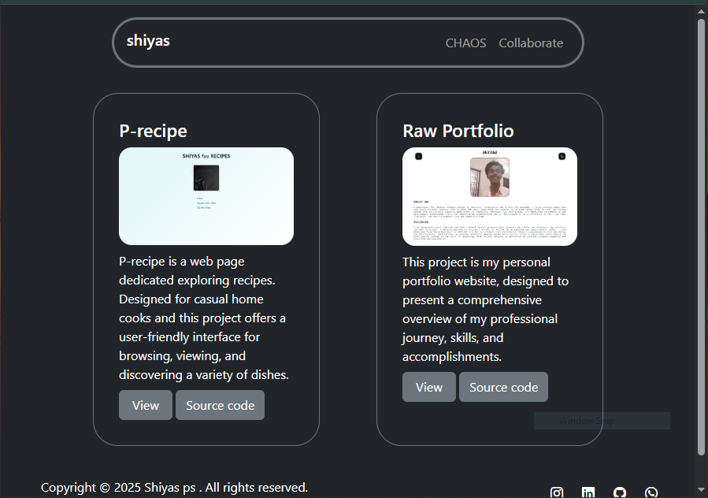
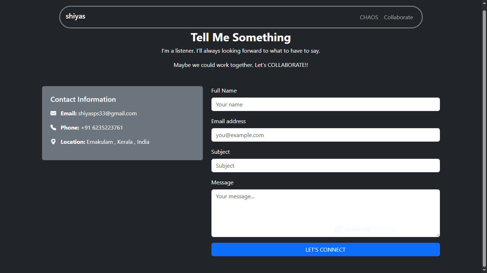

# Bootstrap Portfolio

This repository contains a personal portfolio website built using [Bootstrap](https://getbootstrap.com/). The portfolio showcases projects, skills, and contact information in a responsive and visually appealing format.

## 🛠️ Features

- **Responsive Design:** Adapts seamlessly to desktop, tablet, and mobile devices using Bootstrap's grid system.
- **Project Gallery:** Highlights selected projects with images, descriptions, and links.
- **Contact Form:** Easy way for visitors to get in touch.
- **Navigation Bar:** Smooth navigation between sections.
- **Customizable:** Easily update content and styles to personalize your portfolio.


## [View Portfolio here :sparkles:](https://shiyyas.vercel.app/)

## 📸 Preview 



## 📸 Preview collab page




## Installation

1. **Clone the repository:**
   ```bash
   git clone https://github.com/shiyyaas/Bootstrap_portfolio.git
   cd Bootstrap_portfolio
   ```

2. **Open the portfolio:**
   - Simply open `index.html` in your preferred web browser.

3. **Customization:**
   - Edit the HTML files to update your profile, projects, and contact information.
   - Replace images in the `images/` (or similar) directory.
   - Modify styles by customize Bootstrap as needed.

## 🏗️ Technologies Used

- [Bootstrap](https://getbootstrap.com/)
- HTML5 & CSS3

## 📬 Contributing

Contributions are welcome! Feel free to open an issue or submit a pull request for improvements or new features.

## 📄 License

This project is licensed under the [MIT License](LICENSE).

---

